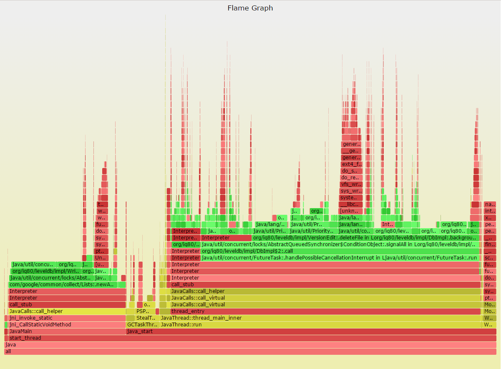

# PerfJ

[](https://gitter.im/coderplay/perfj?utm_source=badge&utm_medium=badge&utm_campaign=pr-badge&utm_content=badge)

`PerfJ` is a wrapper of linux `perf` for java programs.

In order to profile java programs, you need a profiler that can sample stack traces. There has historically been two types of profilers:

* `System profilers:` like Linux perf, which shows system code paths (eg, JVM GC, syscalls, TCP), but not Java methods.
* `JVM profilers:` like hprof, LJP, and commercial profilers. These show Java methods, but usually not system code paths.

Ideally, we need a profile result that does it all: system and Java code paths. Apart from convenience, it also shows system code-paths in Java context, which can be crucial for understanding a profile properly.

The problem is getting a system profiler to understand Java methods and stack traces. If you try Linux perf_events, for example, you'll see hexadecimal numbers and broken stack traces, as it can't convert addresses into Java symbols, and can't walk the JVM stack.

There are two specific problems:

* The JVM compiles methods on the fly (just-in-time: JIT), and doesn't expose a traditional symbol table for system profilers to read.
* The JVM also uses the frame pointer register (RBP on x86-64) as a general purpose register, breaking traditional stack walking.


Thanks to [Brendan Gregg's patch](https://bugs.openjdk.java.net/browse/JDK-8068945). We will have an option to turn on the preservation of frame pointer on JDK 8u60+.

This project is based on Johannes Rudolph's work at [here](https://github.com/jrudolph/perf-map-agent). I just make it more convenient to use.

## Prerequisites

* Linux x86_64
* perf
* JDK 8u60+ / JDK9 ( haven't been released yet, however, there is an [Early Access Release](https://jdk8.java.net/download.html))

## Build

Before starting building `PerfJ`, make sure `gcc` is already installed.


checkout the source from github

    git clone https://github.com/coderplay/perfj.git

and run below in the future building

    cd perfj
    ./gradlew releaseTarGz


## Installation

Before install `PerfJ`, you should install Linux perf first

To install perf on centos/redhat/fedora linux system

    yum install perf.x86_64

To install perf on for ubuntu linux system

    apt-get install linux-tools-common linux-tools-generic linux-tools-`uname -r`

then download `perfj-*.tgz` from the [release page] (https://github.com/coderplay/perfj/releases),  untar it

    tar zxvf perf-*.tgz


## CPU Flame Graph

`PerfJ` can produce flame graph through [Brendan Gregg's FlameGraph tool](https://github.com/brendangregg/FlameGraph)

Below is an example shows the hotspot of an pure java leveldb program. Green is Java layer, yellow is C++ code, and red is system (native user-level, or kernel). Longer bar means higher cpu percentage.



The raw Interactive SVG images is [here] (http://blog.minzhou.info/perfj/perfj.svg).

## Usage

`PerfJ` is only work on new versions of JDK with frame pointer preserved. Here is an example shows how to enable this feature

    java -XX:+PreserveFramePointer ContextSwitchTest

After that, run perfj

    bin/perfj record -e sched:sched_switch -F 99 -g -p `pgrep -f ContextSwitchTest` sleep 5

We will see perf.data as well as /tmp/perf-$pid.map are generated by perfj on local disk. Finally, show the result

    bin/perfj report --stdio

Below is an example result

```
[sudo] password for mzhou:
# ========
# captured on: Mon Jun  8 16:54:55 2015
# hostname : mzhou-server
# os release : 3.13.0-49-generic
# perf version : 3.13.11-ckt17
# arch : x86_64
# nrcpus online : 8
# nrcpus avail : 8
# cpudesc : Intel(R) Core(TM) i7-4770 CPU @ 3.40GHz
# cpuid : GenuineIntel,6,60,3
# total memory : 32887248 kB
# cmdline : /usr/lib/linux-tools-3.13.0-49/perf record -e sched:sched_switch -F 99 -g -p 28241
# event : name = sched:sched_switch, type = 2, config = 0x130, config1 = 0x0, config2 = 0x0, excl_usr = 0, excl_kern = 0, excl_host = 0, excl_guest = 1, precise_ip = 0, attr_mmap2 = 0, attr_mmap  = 1, attr_mmap_data = 0
# HEADER_CPU_TOPOLOGY info available, use -I to display
# HEADER_NUMA_TOPOLOGY info available, use -I to display
# pmu mappings: cpu = 4, software = 1, tracepoint = 2, breakpoint = 5
# ========
#
# Samples: 197K of event 'sched:sched_switch'
# Event count (approx.): 197547
#
# Overhead  Command      Shared Object          Symbol
# ........  .......  .................  ..............
#
   100.00%     java  [kernel.kallsyms]  [k] __schedule
               |
               --- __schedule
                  |
                  |--99.97%-- schedule
                  |          futex_wait_queue_me
                  |          futex_wait
                  |          do_futex
                  |          sys_futex
                  |          system_call_fastpath
                  |          |
                  |          |--99.96%-- pthread_cond_wait@@GLIBC_2.3.2
                  |          |          Unsafe_Park
                  |          |          Lsun/misc/Unsafe;.park
                  |          |          LContextSwitchTest$WorkerThread;.run
                  |          |          call_stub
                  |          |          JavaCalls::call_helper(JavaValue*, methodHandle*, JavaCallArguments*, Thread*)
                  |          |          JavaCalls::call_virtual(JavaValue*, KlassHandle, Symbol*, Symbol*, JavaCallArguments*, Thread*)
                  |          |          JavaCalls::call_virtual(JavaValue*, Handle, KlassHandle, Symbol*, Symbol*, Thread*)
                  |          |          thread_entry(JavaThread*, Thread*)
                  |          |          JavaThread::thread_main_inner()
                  |          |          java_start(Thread*)
                  |          |          start_thread
                  |           --0.04%-- [...]
                   --0.03%-- [...]


#
# (For a higher level overview, try: perf report --sort comm,dso)
#

```
Now that you can see the Java/JVM methods rather than hexadecimal addresses.

## License

This library is licensed under GPLv2. See the LICENSE file.
